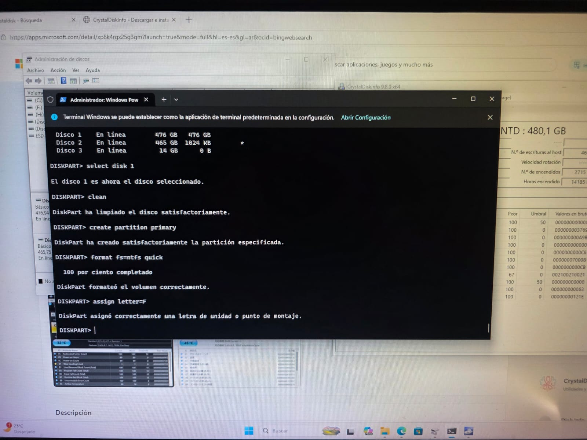

# Guía Práctica: Gestión de Unidades con Diskpart

Este repositorio documenta el procedimiento para el particionado, formateo y asignación de unidades SSD en Windows mediante la línea de comandos.

## 🚀 Pasos Realizados
1. **diskpart**: Inicio de la herramienta.
2. **list disk**: Identificación de discos físicos.
3. **select disk [n]**: Selección del objetivo (Seguridad).
4. **clean**: Limpieza de errores lógicos.
5. **create partition primary**: Estructuración.
6. **format fs=ntfs quick**: Formateo rápido.
7. **assign letter=[letra]**: Asignación de unidad.

## ✅ Resultados
Montaje exitoso de unidades SSD (Team Group y Gigabyte) manteniendo la integridad del sistema operativo en el volumen C.

1. **diskpart**: Inicio de la herramienta.

