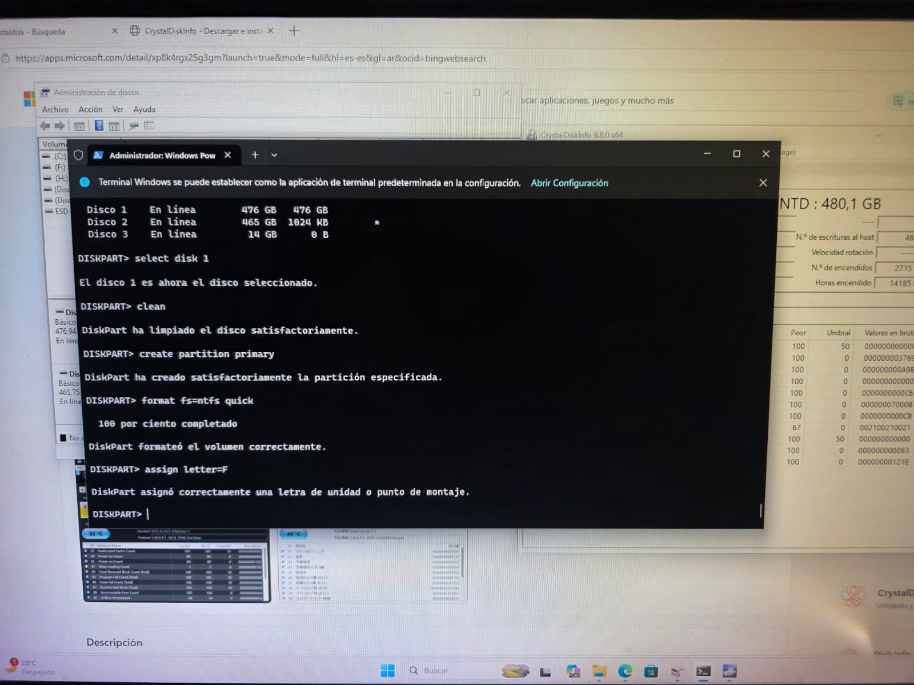
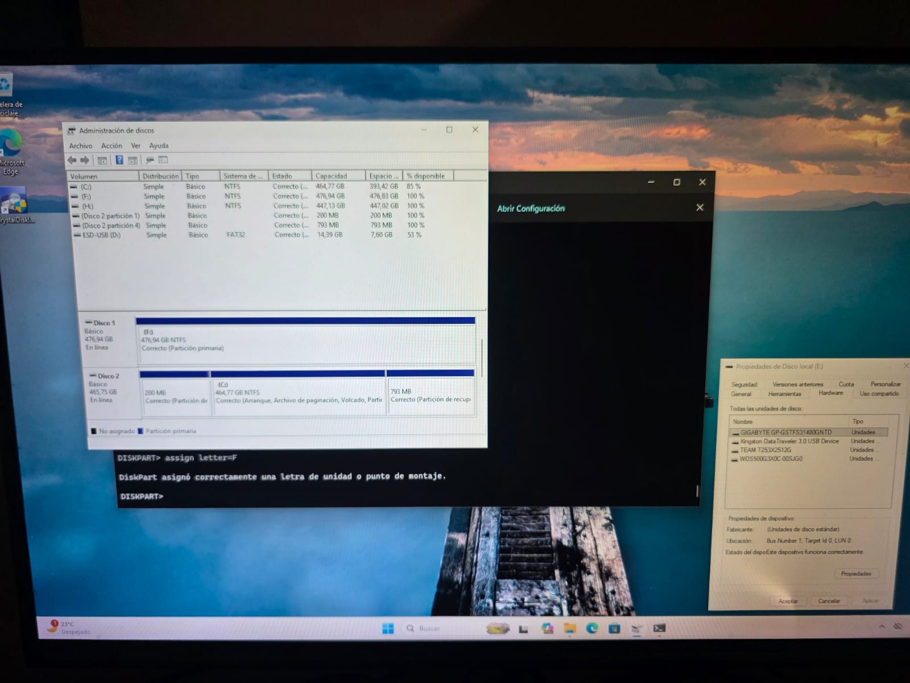
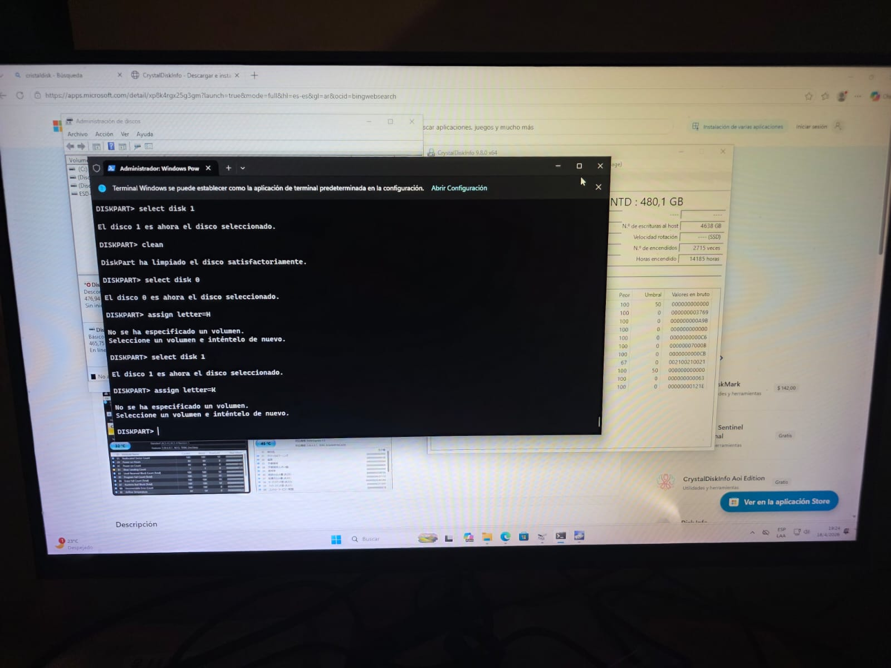
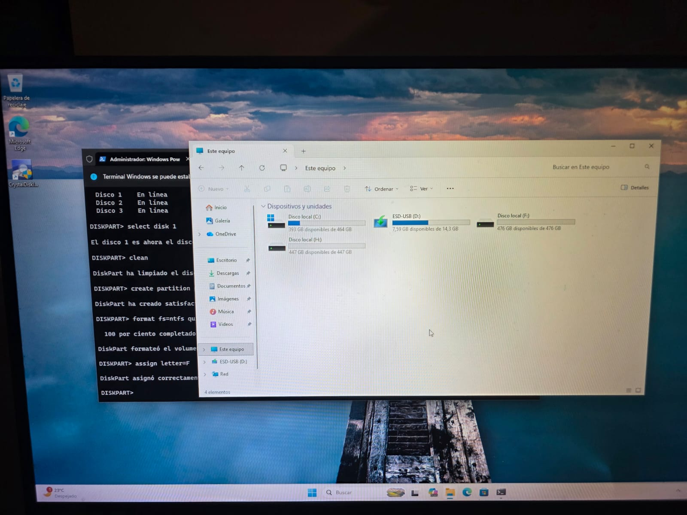
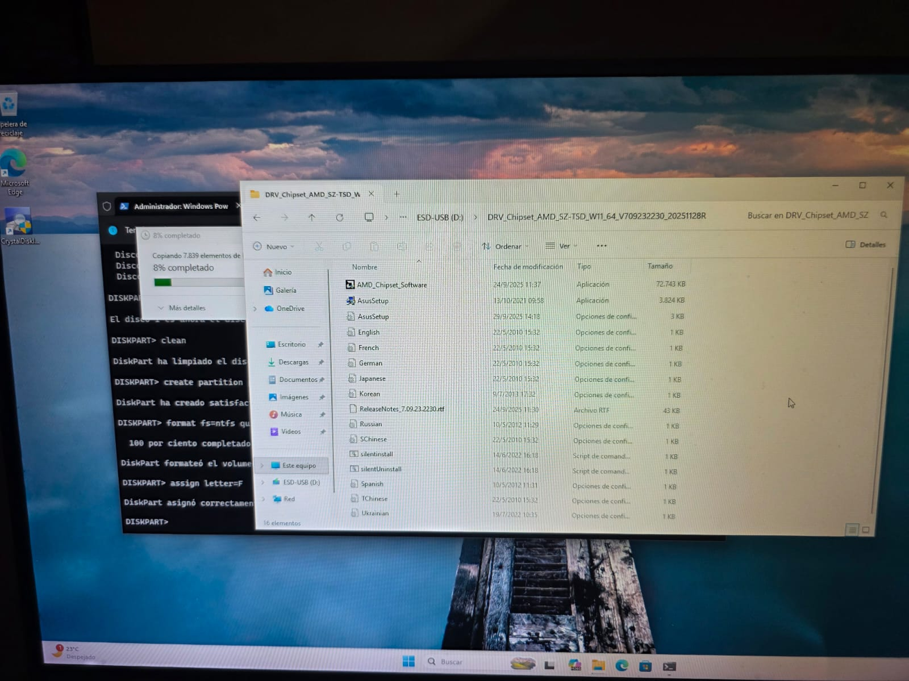
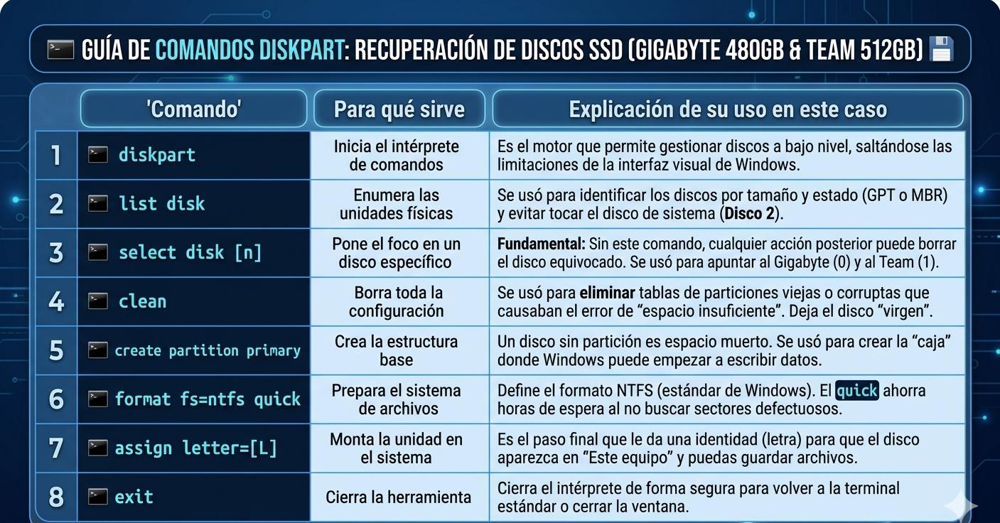
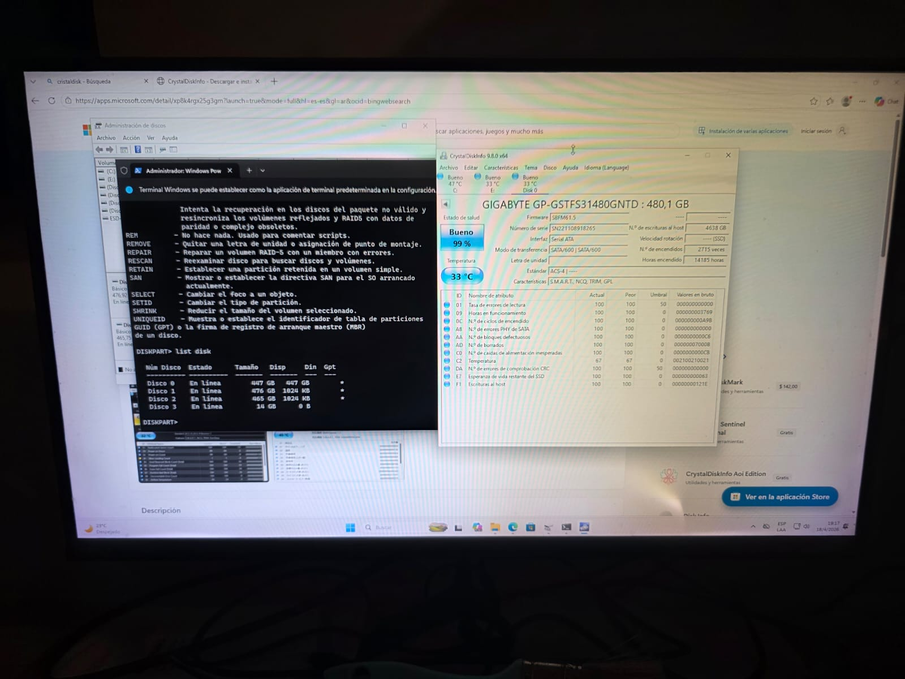
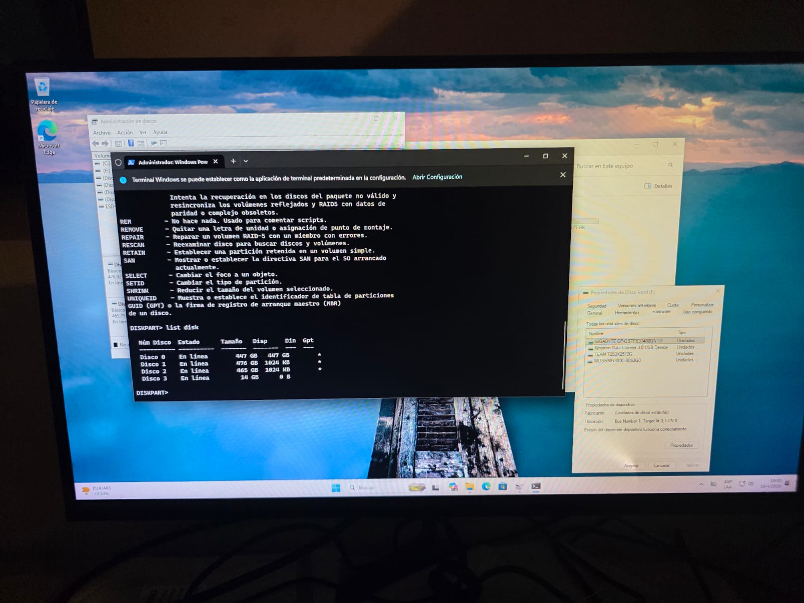
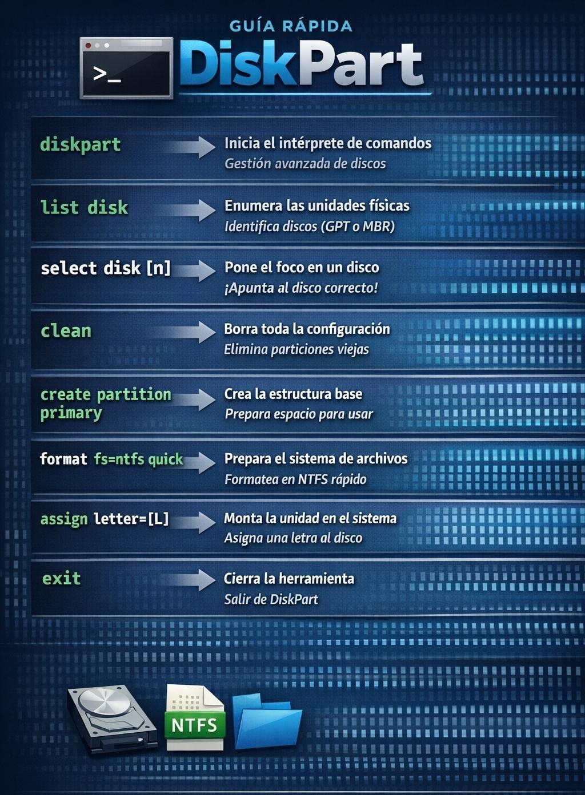
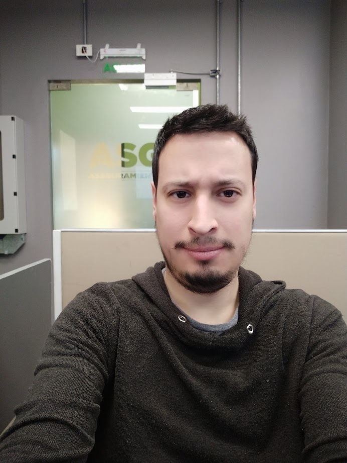

# Guía Práctica: Gestión de Unidades con Diskpart

Este repositorio documenta el procedimiento para el particionado, formateo y asignación de unidades SSD en Windows mediante la línea de comandos.

## 🚀 Pasos Realizados
1. **diskpart**: Inicio de la herramienta.
2. **list disk**: Identificación de discos físicos.
3. **select disk [n]**: Selección del objetivo (Seguridad).
4. **clean**: Limpieza de errores lógicos.
5. **create partition primary**: Estructuración.
6. **format fs=ntfs quick**: Formateo rápido.
7. **assign letter=[letra]**: Asignación de unidad.

## 📌 Comandos utilizados y explicación breve

1. `diskpart` → [Iniciar herramienta Diskpart](ca://s?q=Comando_diskpart_en_Windows)  
   Abre la utilidad de administración de discos en modo consola.

2. `list disk` → [Listar discos físicos](ca://s?q=Comando_list_disk_en_Windows)  
   Muestra todos los discos conectados al sistema para identificar el objetivo.

3. `select disk [n]` → [Seleccionar disco](ca://s?q=Comando_select_disk_en_Windows)  
   Se elige el disco a trabajar. Precaución: verificar número correcto.

4. `clean` → [Limpiar disco](ca://s?q=Comando_clean_en_Windows)  
   Elimina particiones y errores lógicos, dejando el disco en estado inicial.

5. `create partition primary` → [Crear partición primaria](ca://s?q=Comando_create_partition_primary_en_Windows)  
   Genera una partición lista para formatear.

6. `format fs=ntfs quick` → [Formatear NTFS rápido](ca://s?q=Comando_format_fs_ntfs_quick_en_Windows)  
   Aplica un formateo rápido con sistema de archivos NTFS.

7. `assign letter=[letra]` → [Asignar letra de unidad](ca://s?q=Comando_assign_letter_en_Windows)  
   Monta la partición en el sistema con la letra elegida (ejemplo: D:, E:).

## ✅ Resultados
Montaje exitoso de unidades SSD (Team Group y Gigabyte) manteniendo la integridad del sistema operativo en el volumen C.

1. **diskpart**: Inicio de la herramienta.

2. **diskpart**: Inicio de la herramienta.

3. **diskpart**: Inicio de la herramienta.

4. **diskpart**: Inicio de la herramienta.

5. **diskpart**: Inicio de la herramienta.

6. **diskpart**: Inicio de la herramienta.

7. **diskpart**: Inicio de la herramienta.

8. **diskpart**: Inicio de la herramienta.

9. **diskpart**: Inicio de la herramienta.

## 📌 Conclusión

Este laboratorio demuestra el uso práctico de **Diskpart** como herramienta de administración de discos en Windows.  
Se logró particionar, formatear y asignar unidades SSD de manera segura, manteniendo la integridad del sistema operativo en el volumen principal (C:).  

## 🤝 Conclusión y Contacto

* **💼 LinkedIn**: [Horacio Marcelo Nuñez](https://linkedin.com) 
* **📬 Correo Electrónico**: [marcelonh86@gmail.com](marcelonh86@gmail.com)
* **🚀 GitHub**: [@MarceloNunez-NOC](https://github.com/MarceloNunez-NOC)

Este repositorio forma parte de mi portafolio IT en GitHub, donde documento laboratorios y prácticas cotidianas para mostrar mi progreso en **Networking, IT y Administración de Sistemas**.

* **💼 LinkedIn**: [Horacio Marcelo Nuñez](https://www.linkedin.com/in/marcelo-nunez-it/?skipRedirect=true)
* **📬 Correo Electrónico**: [marcelonh86@gmail.com](marcelonh86@gmail.com)
* **🚀 GitHub**: [@MarceloNunez-NOC](https://github.com/MarceloNunez-NOC)

Agradezco el tiempo de quienes visitan mi portafolio en GitHub. Cada laboratorio refleja mi compromiso con el aprendizaje continuo y la práctica aplicada en IT, redes y administración de sistemas. Mi objetivo es demostrar que puedo diagnosticar, resolver y documentar incidentes de manera profesional, utilizando máquinas virtuales y configuraciones de red.

Invito a reclutadores y colegas a seguir mis repositorios, donde iré compartiendo nuevos proyectos, certificados y logros. Estoy abierto a colaborar y aportar mi experiencia en entornos que valoren la constancia y la capacidad de resolver problemas.
